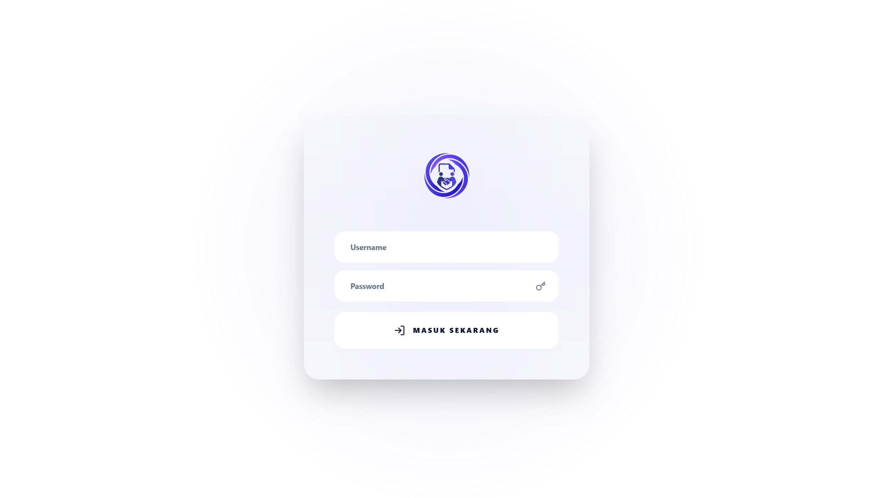
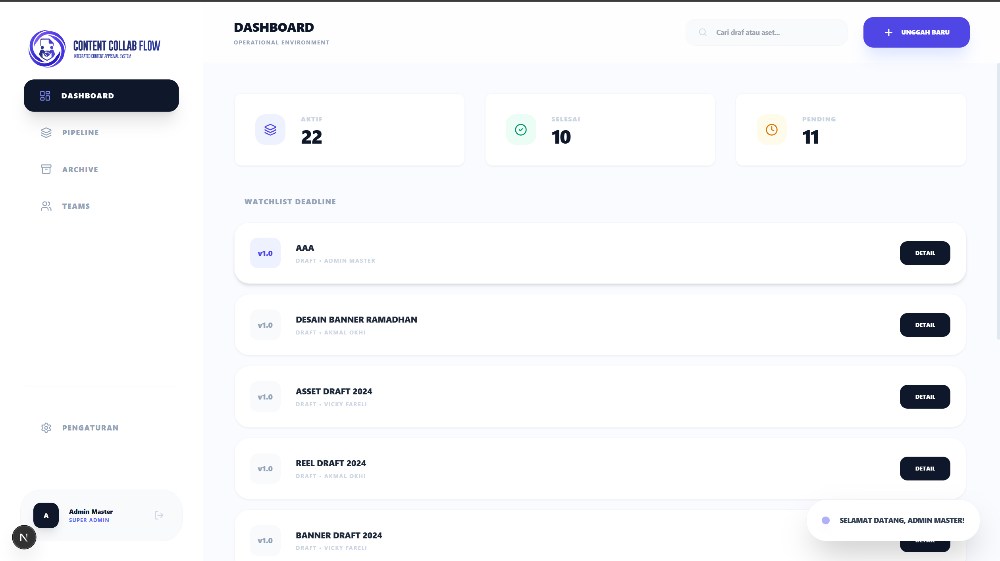
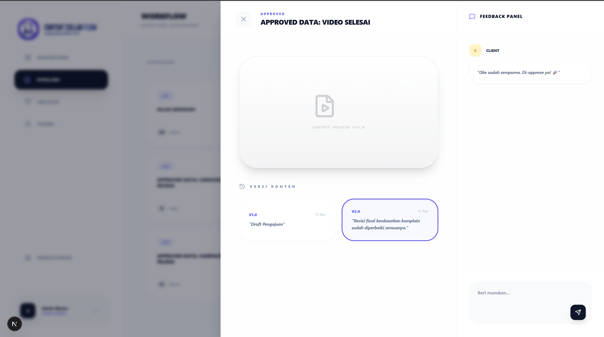

# 🚀 Tugas Besar: revisi.io

> **Dosen Pengampu:** Muhammad Shiddiq Azis, S.T., MBA

---

## 📊 Perancangan Sistem (DFD)

### ERD Diagram

### DFD Level 0

Pada diagram ini menunjukkan gambaran besar interaksi antara sistem revisi.io dengan berbagai entitas yaitu Admin, tim kreatif (Creative Lead, Lead Designer, Video Editor), dan Client. Pengguna dapat melakukan proses login multi-role, mengelola proyek, serta memberikan feedback pada konten. Sistem merespons dengan menampilkan status workflow, notifikasi komentar otomatis, manajemen versi konten (auto-versioning), dan rekapan analitik pada dashboard.

### DFD Level 1

Pada diagram ini, sistem diuraikan menjadi beberapa proses utama yaitu:
- **Proses Login & Autentikasi** untuk mengelola akses pengguna sesuai role.
- **Manajemen Tim & Klien** oleh Super Admin untuk mengatur alokasi tim.
- **Pipeline Workflow** untuk memproses status konten dari Draft → Review → Revisi → Approved.
- **Auto Versioning** yang mengatur kenaikan versi secara otomatis saat revisi disetujui.
- **Sistem Komentar** di mana klien dapat memberikan feedback pada masing-masing versi konten.
- **Laporan Dashboard** yang menampilkan statistik dan progress dari project secara real-time.

---

## 🎨 Mockup Antarmuka
Rancangan UI aplikasi yang berfokus pada pengalaman pengguna.

| Login Page | Dashboard | Core Feature |
| :---: | :---: | :---: |
|  |  |  |

*(Catatan: Silakan sesuaikan tautan gambar mockup di atas dengan gambar UI aplikasi Anda jika sudah tersedia)*

---

## 🛠️ Stack Teknologi
- **Frontend:** Next.js 15, Tailwind CSS, Lucide React
- **Backend:** Next.js (App Router, Server Actions)
- **Database:** Supabase (PostgreSQL)

---

## 📂 Cara Instalasi
1. `git clone https://github.com/HusniNaufal/revisiio.git`
2. `cd revisiio`
3. `npm install`
4. Setup environment variables dengan membuat file `.env.local` berisi `NEXT_PUBLIC_SUPABASE_URL` dan `NEXT_PUBLIC_SUPABASE_ANON_KEY`.
5. Setup database dengan mengeksekusi file `schema_supabase.sql` dilanjutkan dengan `migration_v2.sql` di SQL Editor Supabase.
6. `npm run dev`

---

## 👤 Akun Default (Info Login)
Data akun berikut otomatis tersedia setelah Anda mengeksekusi file setup database di atas.

| Username | Password | Role |
|---|---|---|
| `admin` | `admin123` | Super Admin |
| `akmal` | `akmal123` | Creative Lead |
| `radith` | `radith123` | Lead Designer |
| `dafa` | `dafa123` | Lead Designer |
| `vicky` | `vicky123` | Video Editor |
| `husni` | `husni123` | Client / Reviewer |
| `febri` | `febri123` | Client / Reviewer |

> ⚠️ **Catatan:** Jangan lupa mengganti password akun setelah pertama kali masuk melalui halaman Pengaturan demi keamanan.
